# gpai.app Feature Reference (info.md)

> **Purpose:** This document is the single source of truth for how the upstream
> [gpai.app](https://gpai.app) behaves so future Devin sessions can skip the
> manual walkthrough. Captured from a live signed-in account on 2026-04-30.
> Every feature in our clone (`Asdfyash1/GPAI`) should be measured against this
> reference. **Update this file** whenever upstream UX changes or you find
> something that's not documented here.

> **How to use this file:**
> 1. Pick a feature you're working on (Solver / Visualizer / Chat / Cheatsheet
>    Builder / Report Writer / PDF Notes / Notebook).
> 2. Read its section below — UX shape, inputs, outputs, exports, edge cases.
> 3. Open the matching view in `src/components/<X>View.tsx` and the matching
>    API route in `src/app/api/...`. Compare. Close the gap.
> 4. Update **Gap analysis vs current clone** at the bottom of this file as
>    you fix things — that's the running TODO list for upstream parity.

---

## 0. Top-level navigation

The home view (`gpai.app/home`) shows a centered hero ("AI Solver for *<rotating
discipline>*") with a horizontal pill switcher under it:

| Pill | Destination URL | Notes |
| --- | --- | --- |
| AI Solver | `gpai.app/home` | Default. Single-shot solver. |
| AI Visualizer | `gpai.app/home?destination-feature=visualizer` | Topic-to-diagram. |
| AI Chat | `gpai.app/home?destination-feature=chat` | Multi-turn assistant. |
| **More ▼** | — | Hover/click reveals 4 entries below. |

**More menu** (screenshot 01):

| Item | Destination URL |
| --- | --- |
| AI Report Writer | `gpai.app/home?destination-feature=report-writer` |
| AI PDF Notes | `gpai.app/home?destination-feature=pdf-notes` |
| AI Cheatsheet Builder | `gpai.app/home?destination-feature=cheatsheet` |
| AI Notebook | `gpai.app/home?destination-feature=note` |

**Sidebar (every screen):**

- Logo + collapse button.
- "New task" / "+ Create new" entry (varies by screen).
- "Recent" section listing prior items (notes, reports, etc) with "See all".
- Bottom: "Credits 50/50" progress bar (Beta gives 50/day) and an "Upgrade"
  button (paywalled).
- Avatar + email at the very bottom.

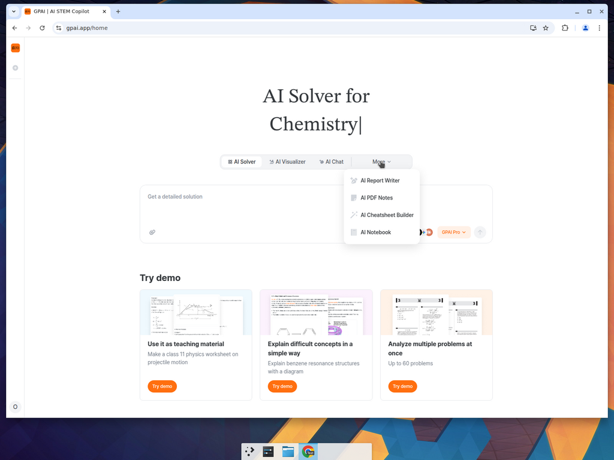

---

## 1. AI Solver (reference only — already shipped in our clone)

Out of scope for this rewrite. The "Try demo" tiles below the composer
("Use it as teaching material", "Explain difficult concepts in a simple way",
"Analyze multiple problems at once") are useful copy if we want to mirror
them.

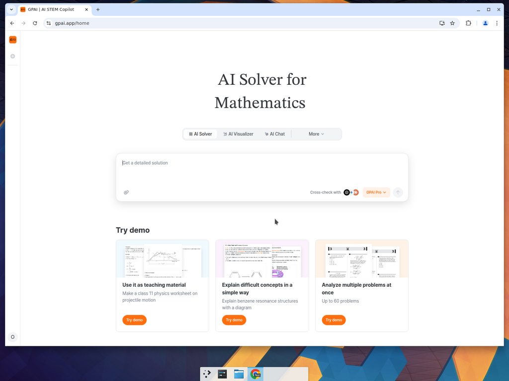

---

## 2. AI Report Writer

**URL:** `gpai.app/home?destination-feature=report-writer` → after creating
a report it becomes `gpai.app/report-writer/r?id=rept_<ms>_<rand>`.

**Tagline:** *Draft reports and refine them with AI.*

### 2.1 Landing (screenshot 02)

Centered hero with a "Start from scratch / Blank page" tile, a composer with
placeholder *"Describe the report you want to create or what you'd like to
edit..."*, and a marketing preview image of the dual-pane editor below.

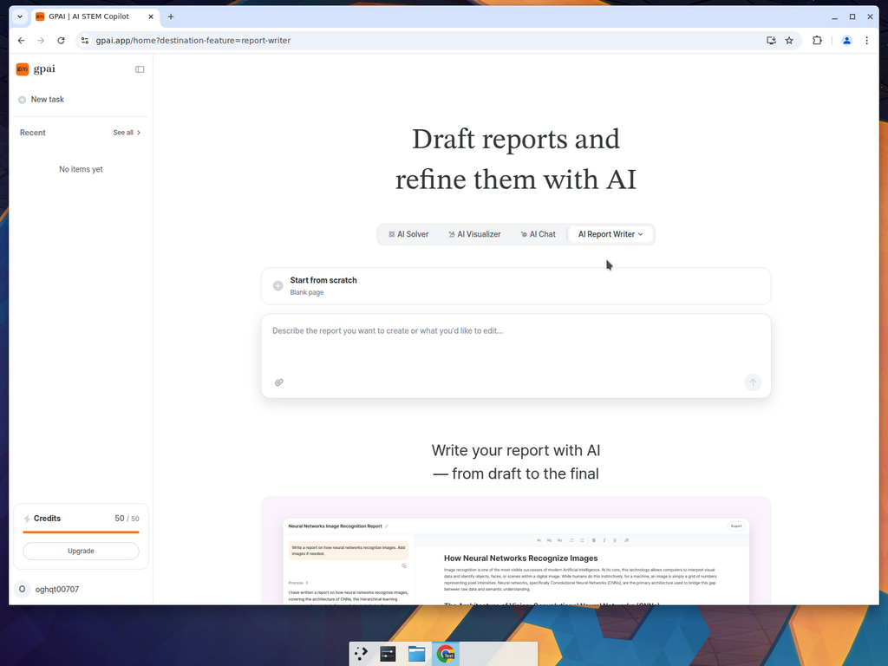

### 2.2 Editor (screenshot 03)

Clicking "Start from scratch" creates a new report and routes to the editor.
The page is a **two-pane workspace**:

| Pane | Contents |
| --- | --- |
| **Left (chat history)** | Header *"How would you like to build or refine your report today?"* with a chat-like message stream above a composer at the bottom. The composer shows placeholder *"Describe the report you want to create or what you'd like to edit..."*, has a paperclip "Add files" button (left) — opens a file-picker over the user's global "Files" library, see §6 — and a submit arrow (right). |
| **Right (document editor)** | A WYSIWYG editor with a top toolbar (H1, H2, H3, bullet list, ordered list, **B**, *I*, U, math `Σ`). Body placeholder: *"Write something..."*. Two slash-style command tiles are shown when empty: **Generate from the scratch** (doc icon) and **Write with AI edit** (sparkles icon). |
| **Top bar (right pane)** | Editable report title `New report` ✏️, **Export ▼** orange button (top-right corner). |

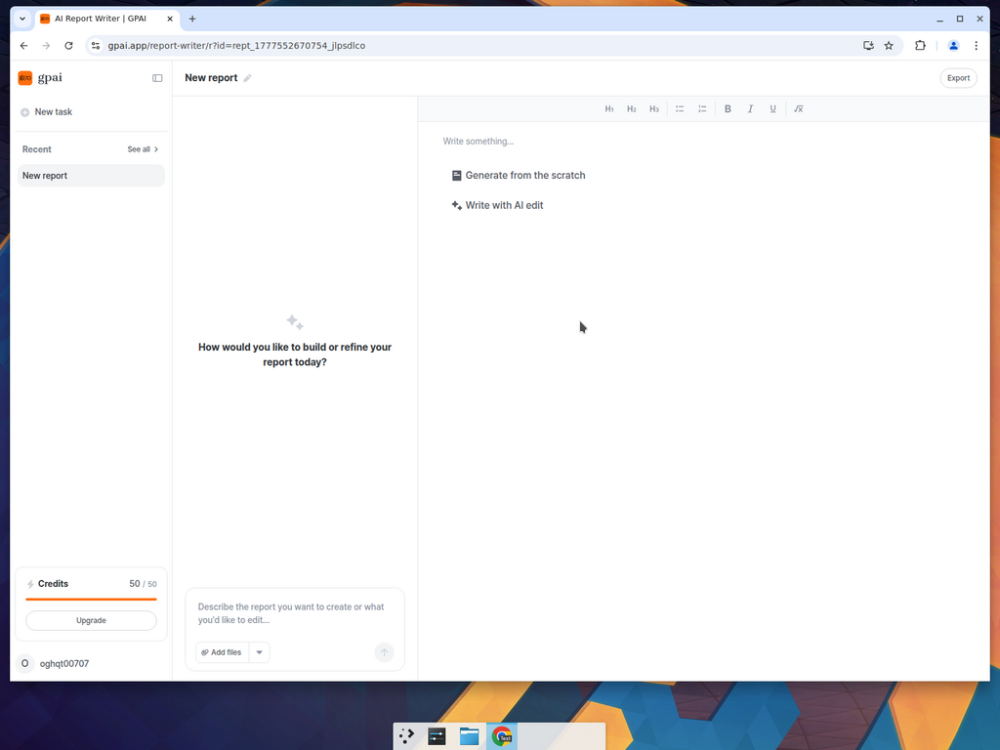

### 2.3 "Generate from the scratch" modal (screenshot 04)

Modal title: **Generate a report with AI**. Fields:

1. *Describe the report you want to create* — textarea.
2. *Upload materials and references (Optional)* — dropzone that supports
   drag-drop or "Select file".
3. **Generate report** primary CTA.

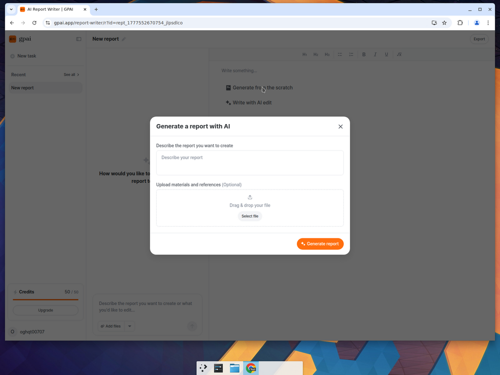

### 2.4 "Write with AI edit" inline command (screenshot 05)

Inline mini-composer that appears at the cursor position inside the document.
Placeholder: *"Describe what to write. I'll help you write it."* Bottom row
shows a small **Ask GPAI ↗** button. Behaves like Notion AI / ChatGPT-canvas
inline-suggestion.

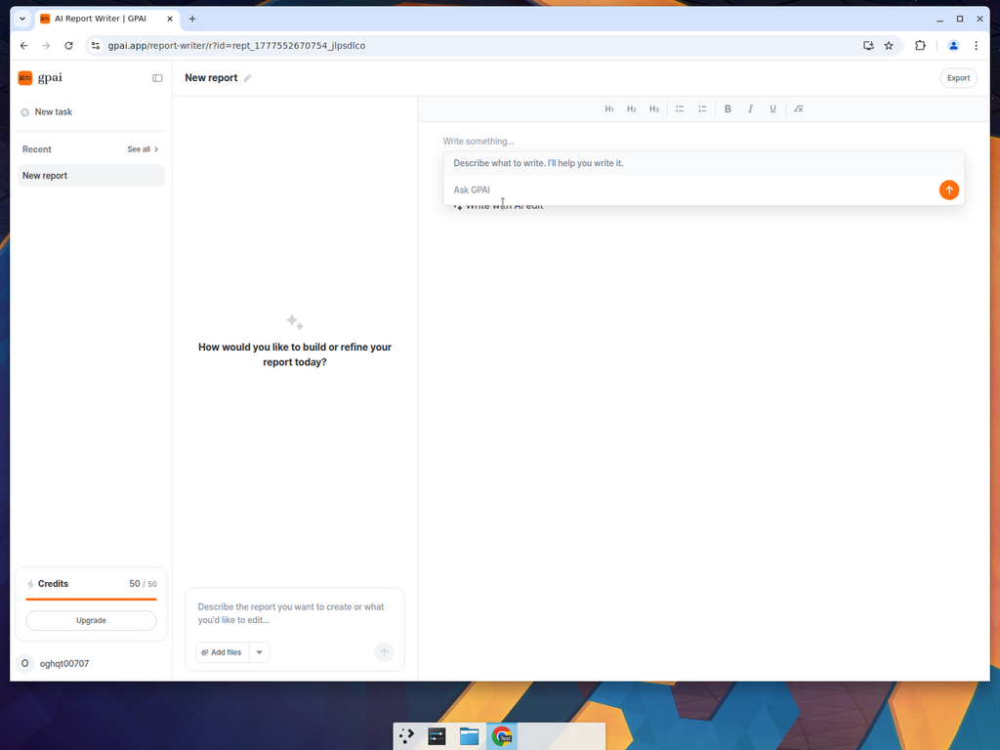

### 2.5 Export menu (screenshot 06)

Top-right **Export ▼** opens a 3-item dropdown:

| Action | Output |
| --- | --- |
| Copy entire report | clipboard |
| Export to PDF | `.pdf` |
| Export to DOCX | `.docx` |

**No `.md` export** — confirms upstream treats reports as documents, not as
loose markdown.

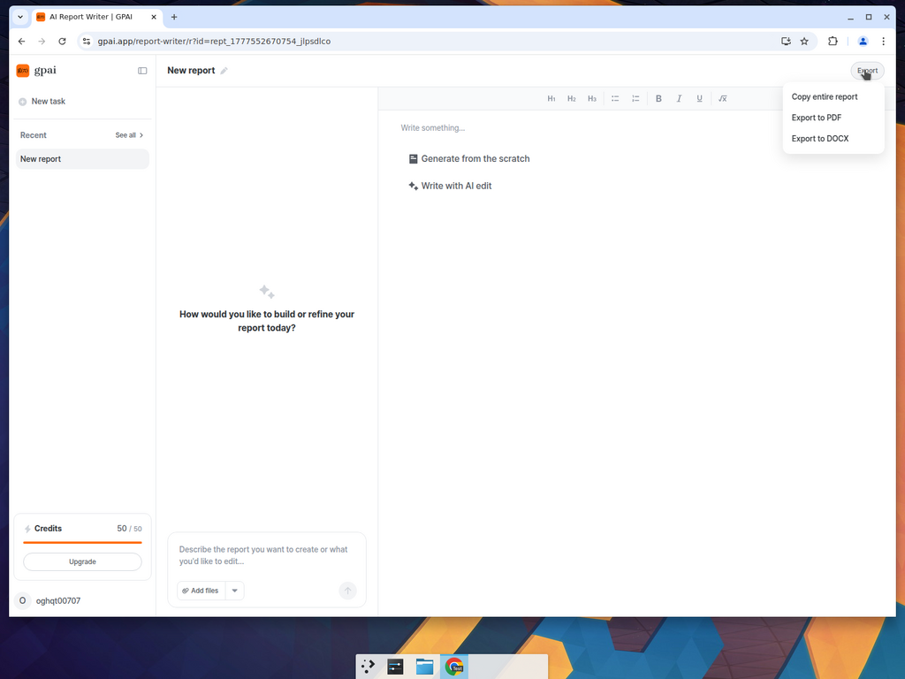

### 2.6 Behavior to mirror

- Persist on creation: hitting "Start from scratch" mints a stable report ID
  and routes to a sharable URL immediately. The sidebar's "Recent" gets the
  new entry as soon as the editor mounts.
- Two-pane layout (chat left, doc right) is the differentiator vs raw
  streamed-markdown views. The chat refines the doc; the doc is editable.
- Export is **PDF + DOCX**, not markdown.

---

## 3. AI PDF Notes (BETA)

**URL:** `gpai.app/home?destination-feature=pdf-notes` → after upload routes
to `gpai.app/pdf-notes/detail?id=<uuid>` for the section index, and
`gpai.app/pdf-notes/section?id=<uuid>&sectionId=<uuid>` for a specific section.

**Tagline:** *Turn any PDF into complete visual notes.*

### 3.1 Landing (screenshot 07)

- BETA badge above the heading.
- Quota strip: *"Today's free PDF Notes — During Beta, you get 2 free PDF
  Notes per day."* + **Claim** button.
- **Output language** dropdown (default: English).
- Big drop zone: *"Select a PDF or drag and drop here. Max 100 MB · up to
  1500 pages"* + **Select file** button.
- **Create notes** primary button (disabled until a file is loaded).

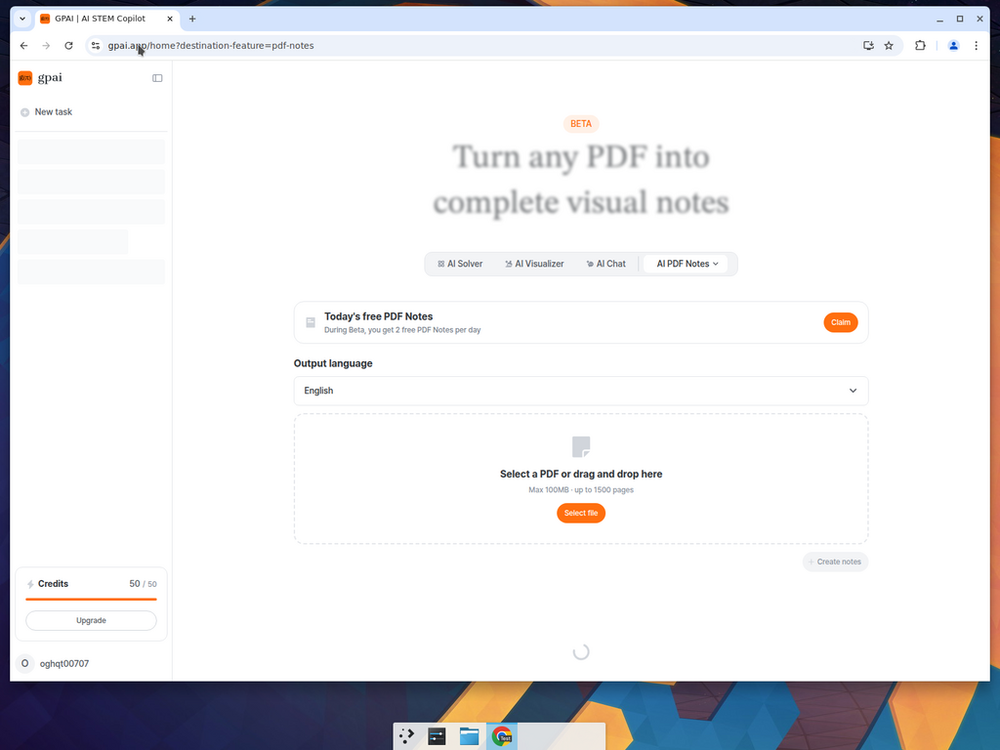

### 3.2 Sample notes (screenshot 08)

Below the dropzone, an **Explore Sample Notes** rail with curated cards, each
showing PDF thumbnail + title + relative time + page count:

| Sample | Pages |
| --- | --- |
| Attention Is All You Need | 15p |
| Efficient Estimation of Word Representations in Vector Space | 12p |
| Introduction to Algorithms | 1313p |
| Guyton and Hall Textbook of Medical Physiology | 52p |
| Signals and Systems | 987p |

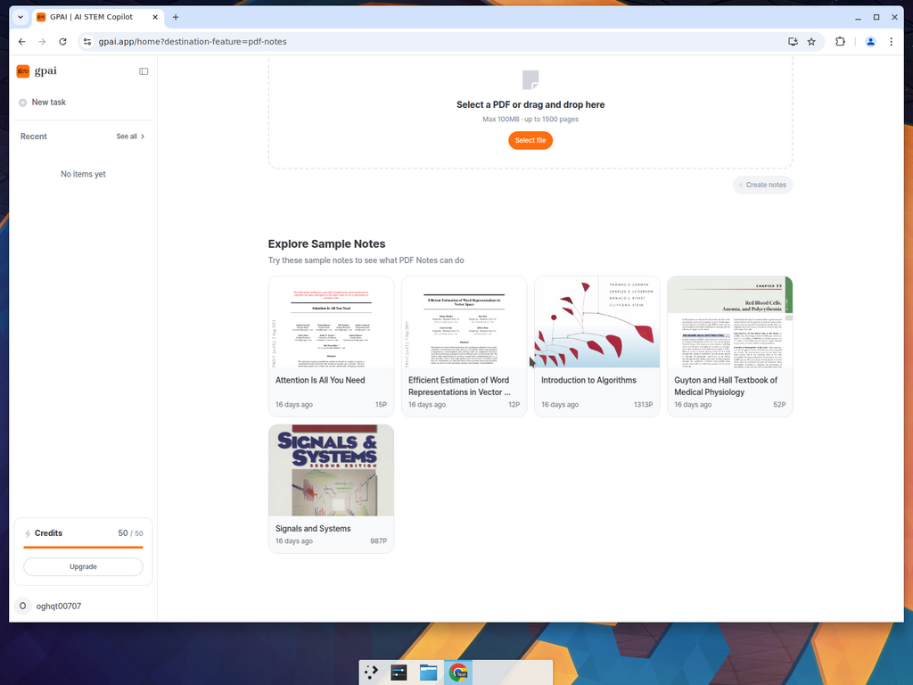

### 3.3 Detail / sections page (screenshot 09)

For "Attention Is All You Need" the detail page shows:

- ← **Back** link.
- PDF thumbnail (left) + title + metadata line *"CS · graduate · ENGLISH ·
  15p"*.
- Action icons (right): download, share, more (`...`).
- **SECTIONS** label, then a numbered list:
  - `01 ✓ Main Architecture and Results — p. 2-15`

So PDF Notes does NOT generate one giant blob — it generates an **outline of
sections** keyed to source page ranges, each clickable.

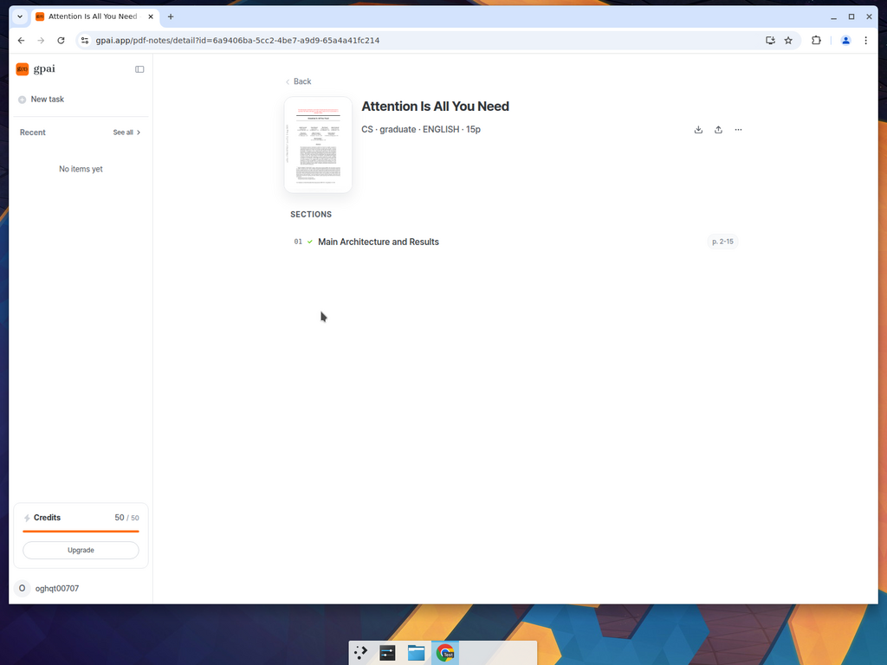

### 3.4 Section content view (screenshots 10 & 11)

Layout = three-column sticky shell:

| Column | Contents |
| --- | --- |
| **Left sticky outline** | The full nested heading tree of the section, e.g. *Transformer Model → 1. Introduction → 2. Background → 3. Model Architecture → 3.1 Encoder and Decoder Stacks → 3.2 Attention → 3.2.1 Scaled Dot-Product Attention → ...*. Highlights the current heading. |
| **Center body** | Hierarchical bullet notes with **bold subsection labels** and indented sub-bullets. Inline rendering of: <br>• KaTeX math (e.g. `Attention(Q,K,V) = softmax(QK^T / √d_k) V`) <br>• Auto-generated diagrams (e.g. a **Scaled Dot-Product Attention** boxed pipeline figure: MatMul → SoftMax → Mask (opt.) → Scale → MatMul ← Q, K, V) — looks like a Mermaid `flowchart LR` rendering. <br>• Tables, blockquotes, code blocks where relevant. |
| **Top right** | "Send feedback" pill, download icon, more (`...`). |
| **Top center toolbar** | `A-` / `A+` / `Reset` font-size controls. |
| **Bottom pager** | `< Previous · 1/1 · Next >` to step through subsections. |

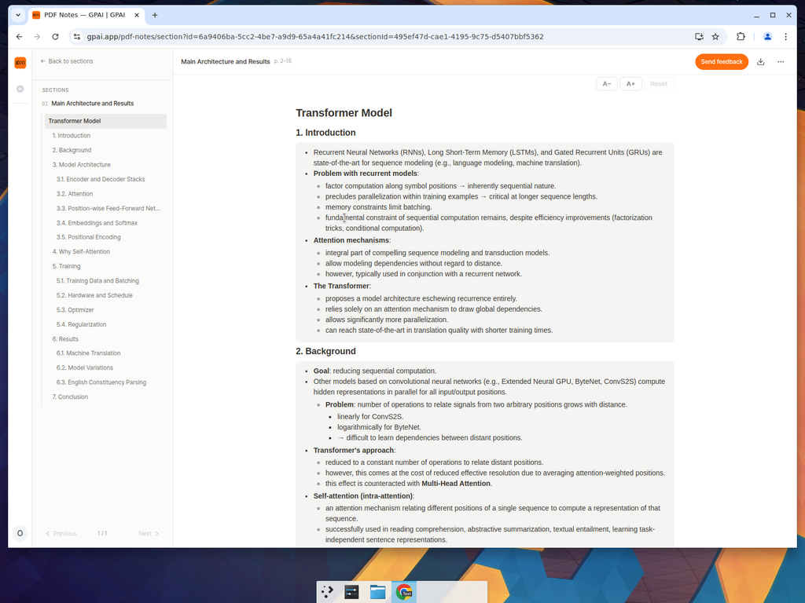
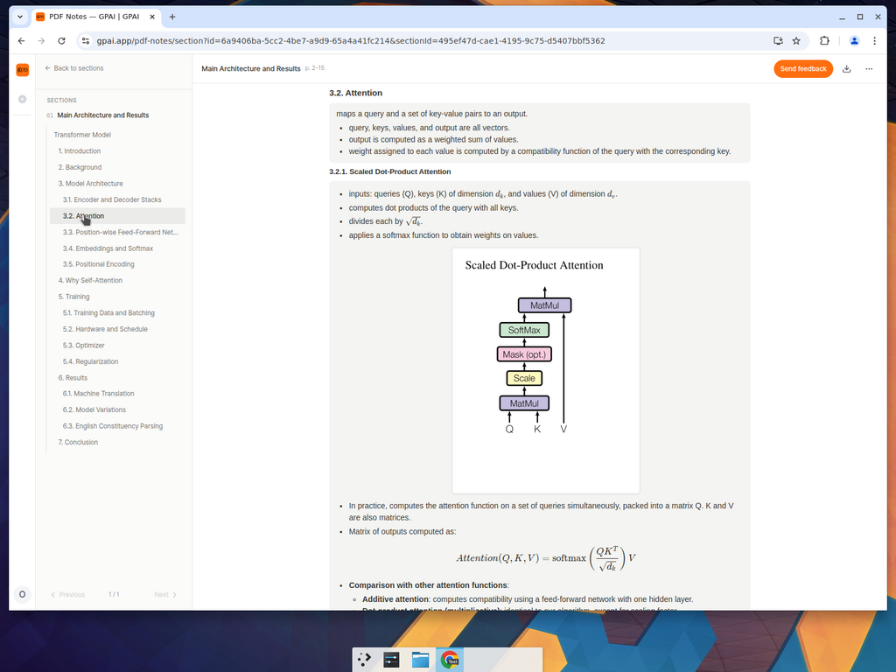

### 3.5 Behavior to mirror

- **Section-aware generation** — the LLM emits a structured outline keyed to
  source page ranges, not a single markdown blob. Each section is its own
  page.
- **Mixed media** — bullets + KaTeX + diagrams + tables in the same view.
- **Sticky outline** that scroll-spies the current heading.
- **Font size and pager controls** — small UX details that make the page
  feel like a study tool, not a chat reply.
- **Source language selector** before generation (currently English-only on
  upstream during BETA).
- **PDF size cap of 100 MB / 1500 pages**, with a daily quota.

---

## 4. AI Cheatsheet Builder

**URL:** `gpai.app/home?destination-feature=cheatsheet`.

**Tagline:** *Create exam-ready cheatsheet.*

### 4.1 Landing (screenshot 12)

- Composer placeholder: *"Enter a topic or upload files"*. Same paperclip
  + submit-arrow controls as the Solver composer.
- Three suggestion chips below the composer:
  - *Generate 2 page mechanics cheatsheet for Hibbeler*
  - *Generate 2 page cheat sheet for Halliday Physics*
  - *Generate 2 page algorithm cheatsheet for CLRS*
- Below: marketing preview image of the workspace.

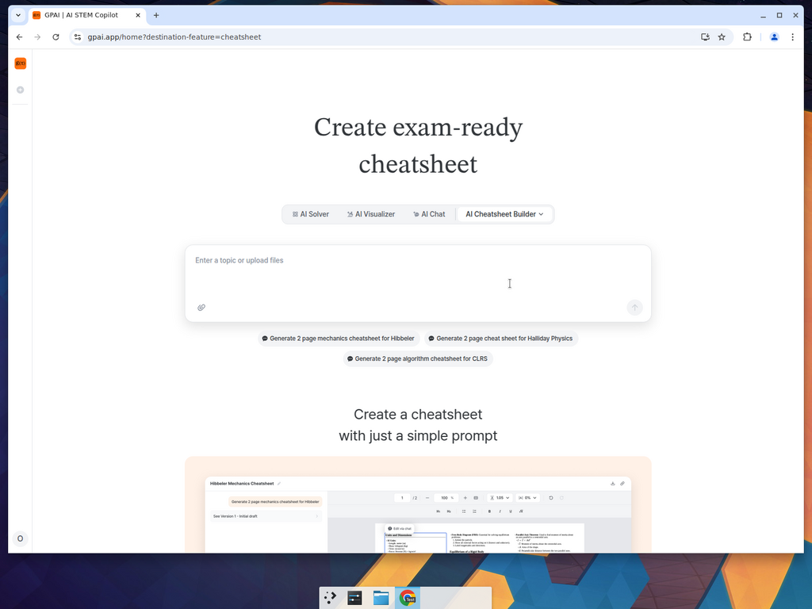

### 4.2 Output preview (screenshot 13)

A two-pane workspace, similar to Report Writer but tuned for **dense
two-column print-A4 cheatsheets**:

| Pane | Contents |
| --- | --- |
| **Left** | Chat history (e.g. *"Generate 2 page mechanics cheatsheet for Hibbeler"*, *"See Version 1 - Initial draft"*) with a "Ask for changes" composer at the bottom. |
| **Right** | The actual cheatsheet, rendered as a paginated A4 document with: <br>• Page nav `1 / 2`, zoom (`100%`), zoom in/out, fit (`105%`), `0%`, undo, Edit toolbar (B, I, math, alignment). <br>• Two-column layout, ~9pt body. <br>• Section headers like *Vectors*, *Force Systems*, *Frames and Machines*, *Center of Gravity and Centroid* with bullet formulas + short notes. |
| **Top right** | Download icon, share icon. |
| **Top left of right pane** | "Edit via chat" tab (toggles whether the chat pane is open) and the cheatsheet title with rename pencil. |

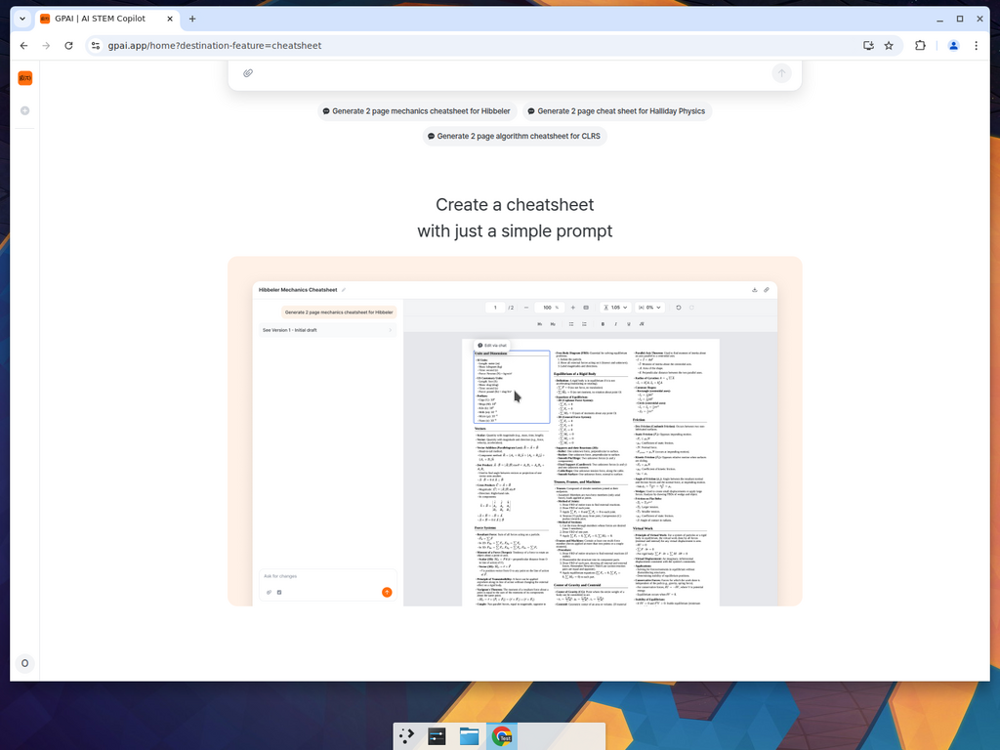

### 4.3 Behavior to mirror

- The **generated artifact is a paginated PDF-shaped document**, not a
  scrolling markdown reply. Two columns, A4, dense.
- "Edit via chat" — the chat is for *modifying* the existing cheatsheet,
  not for getting a fresh response that replaces the artifact.
- Page nav + zoom controls inside the artifact.
- **Download is a real PDF**, not `.md`. (Our clone currently emits `.md` —
  see the gap analysis at the bottom.)

---

## 5. AI Notebook (NotebookLM-style)

**URL:** `gpai.app/home?destination-feature=note` → after creating a notebook
routes to `gpai.app/notebook/subject?id=<uuid>`.

**Tagline:** *Chat with your materials.*

### 5.1 Empty state (screenshot 14)

Centered card: *"No notebooks yet. Create one to start organizing your
materials."* + orange **+ Create new** button.

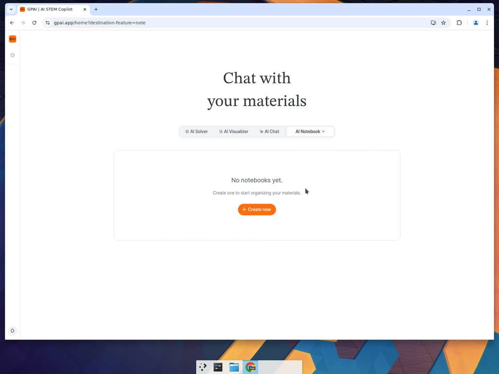

### 5.2 Add Source modal (screenshot 15)

Clicking *+ Add Source* (or the file area inside a fresh notebook) opens
the **Add source** modal:

- Drop zone heading: *"Drag and drop files here — PDF, images, documents,
  audio, video"*.
- Source-type buttons row:

| Button | Behavior |
| --- | --- |
| Upload | local file picker |
| YouTube | sub-modal (screenshot 16) — paste public YouTube URL |
| Drive | (likely Google Drive picker) |
| Text | sub-modal (screenshot 17) — paste raw text with character counter |

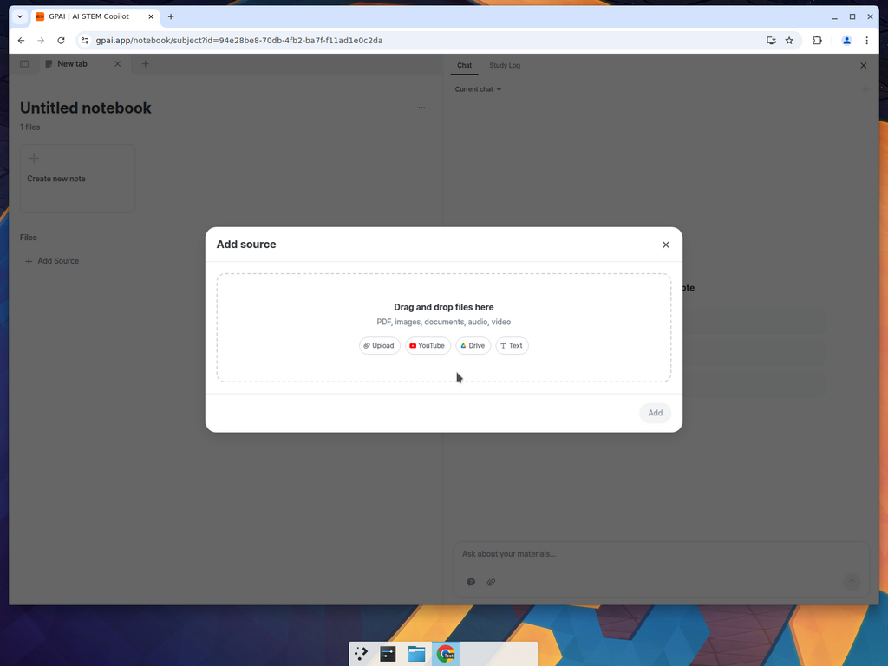
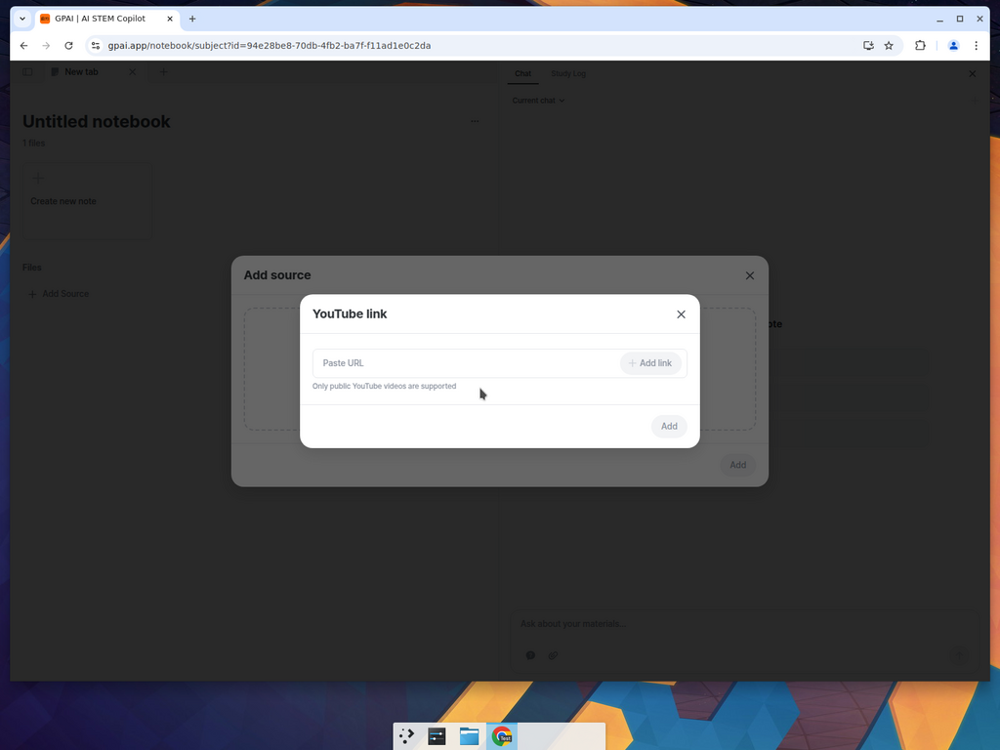


### 5.3 Notebook workspace (screenshots 18 & 19)

Two-pane layout with a tab bar at the top showing every open notebook
(`📓 New tab` × `+`). Multiple notebooks open simultaneously.

| Pane | Contents |
| --- | --- |
| **Left (Files / notes)** | Editable notebook title + `...` menu (Rename / **Delete**). "1 files" stat. **+ Create new note** tile (opens the Note modal — see §5.4). **Files** header with a folder-button. **+ Add Source** link. As sources/notes are added, they list under each header. |
| **Right (Chat panel)** | Tabs: **Chat \| Study Log**. **Current chat ▼** dropdown for selecting threads. Empty-chat state shows *"Chat to my note"* with three suggestion chips: *What can you do?*, *Find exam-worthy parts*, *Explain so I can understand in 5 min*. Bottom: *"Ask about your materials..."* input + attach + submit. |

The **Study Log** tab is a free-form journaling area (placeholder leaks the
Korean *"내용을 입력하세요..."* — i.e. *"Please enter content..."*). Persists
across sessions.

There is a `beforeunload` warning *"Leave site? Changes you made may not
be saved"* — the notebook has unsaved-state guards.

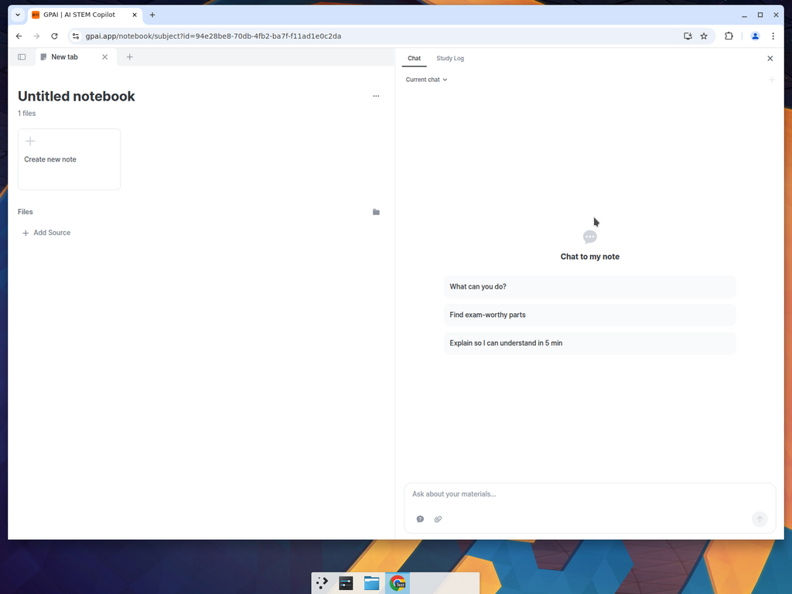
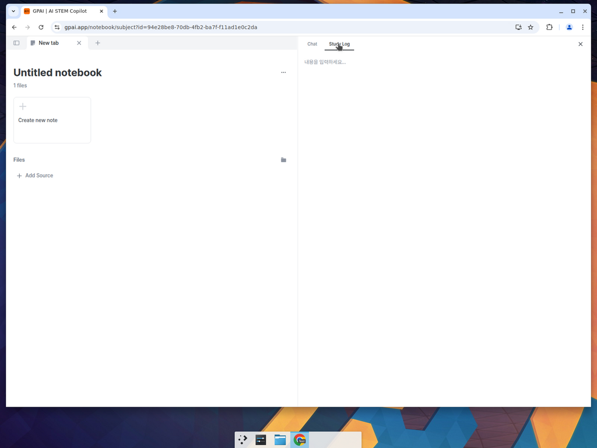

### 5.4 Create note modal (screenshot 20)

Clicking *+ Create new note* opens a **Create** modal that lets the user
turn their sources into one of three artifacts:

| Note Type | Description |
| --- | --- |
| **Summary** (default, orange-bordered) | *Generate a summary based on all the sources you uploaded.* |
| **Quiz** | *Generate quiz questions and practice solving them.* |
| **Flashcard** | *Generate flashcards and check the answers with a simple click.* |

**Sources** picker below shows `0/20 selected`, a **Search file** input, and
a checkboxed list of every source in the notebook (max 20). The default
notebook ships with one entry — `study-log` — which is the Study Log itself.

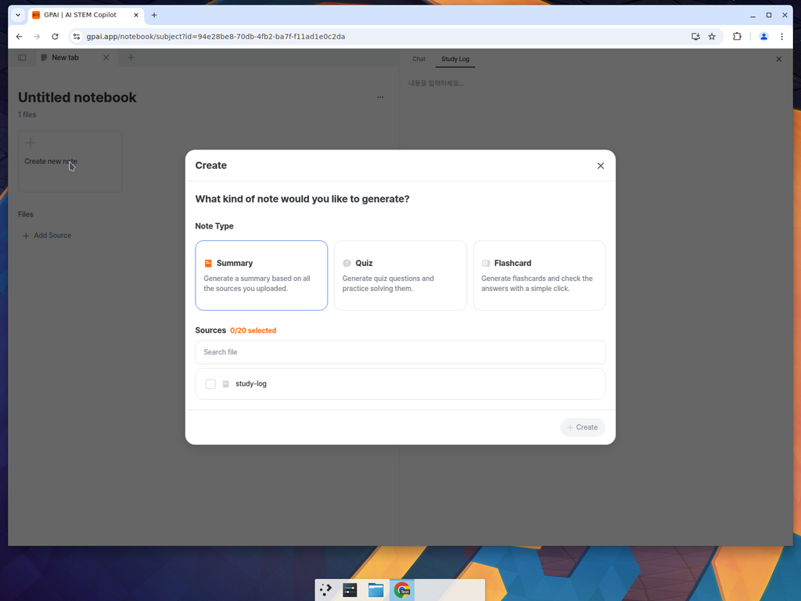

### 5.5 Behavior to mirror

- Multi-source workspace = the Notebook is the **container**; individual
  Summary / Quiz / Flashcard notes are **artifacts** the user creates from
  picked sources.
- **6 source types** out of the box: PDF, image, document, audio, video,
  YouTube transcript, raw text, Drive — vs our clone's "free-form prose
  notebook entry" with no sources at all.
- **Tabs at the top** allow multiple open notebooks side-by-side.
- **Persistent chat threads + Study Log** alongside the notes.
- **Quiz and Flashcard** as first-class generated artifacts. We already
  have `/api/quiz` for the Solver right rail; need to wire it into the
  Notebook.
- **`beforeunload` guard** on unsaved notebooks.

---

## 6. Cross-feature: global Files library

The "Add files" button in the Report Writer composer opens a list of files
from the user's account (currently *"No files found"* on a fresh account).
This implies upstream has a **single global Files store**: a PDF uploaded in
PDF Notes is reusable as a Report Writer reference, a Notebook source, etc.
Not yet replicated in our clone (every view re-uploads).

---

## 7. Gap analysis vs current clone (running TODO)

> Update this table whenever you ship a parity fix. Mark `[x]` for done,
> `[~]` for partial, `[ ]` for not started.

| # | Feature | Upstream behavior | Current clone | Status |
| --- | --- | --- | --- | --- |
| 1 | Routes accept all 7 modes | n/a | `notebook \| pdf-notes \| report` were 400'd | `[x]` PR #24 |
| 2 | Cheatsheet **Download** = real PDF | one-click `.pdf` from Export menu | emits a `.md` file | `[ ]` |
| 3 | Report Writer **Download** = PDF / DOCX | Export menu has both | emits `.md` | `[ ]` |
| 4 | PDF Notes **Download** = PDF | download icon emits PDF | emits `.md` | `[ ]` |
| 5 | Notebook page **Download** = PDF | (per-note download in upstream) | emits `.md` per page | `[ ]` |
| 6 | Report Writer dual-pane editor | chat left + WYSIWYG editor right | single-pane streamed markdown | `[ ]` |
| 7 | Report Writer "Write with AI edit" inline | inline mini-composer at cursor | absent | `[ ]` |
| 8 | Report Writer Export modal (Copy / PDF / DOCX) | 3-item menu | only `.md` | `[ ]` |
| 9 | PDF Notes file upload pipeline | drop PDF → outline of sections keyed to page ranges | view exists but only takes a topic prompt; PDF upload not wired | `[ ]` |
| 10 | PDF Notes section pages | three-column sticky outline + paged subsections + KaTeX + Mermaid | none — single streamed markdown | `[ ]` |
| 11 | PDF Notes font size + Reset | A- / A+ / Reset toolbar | none | `[ ]` |
| 12 | PDF Notes daily quota strip | "2 free per day" banner | none | `[ ]` |
| 13 | PDF Notes language picker | English dropdown | none | `[ ]` |
| 14 | Cheatsheet two-column A4 paginated | true paginated `1/N` doc with zoom + edit-via-chat | print-only A4 stylesheet, scrolls | `[~]` |
| 15 | Cheatsheet "Edit via chat" tab | tab that toggles chat pane | absent | `[ ]` |
| 16 | Notebook = NotebookLM | sources + Summary/Quiz/Flashcard notes + chat + Study Log + multi-tab | single-pane "stream a notebook entry from a prompt" | `[ ]` |
| 17 | Notebook source types: PDF/img/doc/audio/video/YouTube/Drive/Text | 8 types | none | `[ ]` |
| 18 | Notebook Quiz + Flashcard artifacts | first-class | `/api/quiz` exists for Solver rail only | `[ ]` |
| 19 | Notebook persistent threads + Study Log | yes | absent | `[ ]` |
| 20 | Global Files library | shared across views | every view re-uploads | `[ ]` |
| 21 | Sample Notes rail | curated PDF examples | none | `[ ]` |
| 22 | Daily Beta quota / "Upgrade" CTA | yes | none (no auth yet) | n/a (auth out of scope) |
| 23 | `beforeunload` unsaved-changes guard | yes on notebook | none | `[ ]` |
| 24 | Sidebar "Recent" with timestamped items | yes | partial — needs polish | `[~]` |
| 25 | Top tab bar in Notebook (multi-open) | yes | none | `[ ]` |

---

## 8. Source data caveats

- Captured from the live signed-in account on **2026-04-30** (UTC ~12:30).
- gpai.app is in BETA; some labels (e.g. Korean placeholder on Study Log)
  reveal incomplete localization.
- Some demo content (e.g. *Hibbeler Mechanics Cheatsheet* hero image) is a
  marketing screenshot rather than a live-generated artifact — formats may
  differ slightly when generated fresh.
- Pricing / login flows are NOT documented here (per the user, out of scope
  for this build).

---

## 9. Where to look in the codebase

| Feature | Component | API route(s) |
| --- | --- | --- |
| Report Writer | `src/components/DocumentView.tsx` (mode `"report"`) | `src/app/api/educate/stream/route.ts` |
| PDF Notes | `src/components/PdfNotesView.tsx` (mode `"pdf-notes"`) | `src/app/api/educate/stream/route.ts` + `src/app/api/parse-pdf/route.ts` (PDF text extraction) |
| Cheatsheet Builder | `src/components/CheatsheetView.tsx` (mode `"cheatsheet"`) | `src/app/api/educate/stream/route.ts` |
| Notebook | `src/components/NotebookView.tsx` (mode `"notebook"`) | `src/app/api/educate/stream/route.ts` |
| Vision / OCR | `src/lib/vision.ts` (`analyzeUploadedImages`) — single provider: NVIDIA Nemotron-3-Nano Omni 30B Reasoning (`nvidia/nemotron-3-nano-omni-30b-a3b-reasoning`), overridable via `NVIDIA_VISION_MODEL` env var, with `[ATTACHMENT_UNREADABLE]` failure marker | invoked by `/api/educate/stream` and `/api/educate`; orchestrator hard-stops on the failure marker so unreadable attachments never reach the LLM |
| System + task prompts | `src/lib/prompts.ts` (`getSystemPrompt`, `buildTaskPrompt`) | shared across modes |
| Orchestrator | `src/lib/orchestrator.ts` (`streamEducationalSolverDraft`, `runEducationalOrchestrator`) | shared |

When extending a feature, prefer to:

1. Add a new dedicated `/api/<feature>/route.ts` for the feature-specific
   pipeline (PDF parsing, source ingestion, etc.) instead of overloading
   `/api/educate`.
2. Keep streaming via `streamText` from the AI SDK so the UI can render
   incrementally.
3. Reuse `analyzeUploadedImages` and `parsePdf` for source ingestion — do
   NOT re-implement vision or PDF parsing.

### Vision / OCR pipeline (updated 2026-05-02)

`analyzeUploadedImages` in `src/lib/vision.ts` uses a **single vision provider**:

- **NVIDIA Nemotron-3-Nano Omni 30B Reasoning** (`nvidia/nemotron-3-nano-omni-30b-a3b-reasoning`) — a multimodal reasoning model that handles handwritten math OCR far more accurately than the previous Llama-3.2 vision models. Requires `NVIDIA_API_KEY` (or `NVIDIA_VISION_API_KEY` / `NIM_API_KEY`). Overridable via `NVIDIA_VISION_MODEL` env var.

**Previous providers removed (PR #31, 2026-05-02):**
- ~~Google Gemini 2.0 Flash~~ — removed per user request; no `GEMINI_API_KEY` needed.
- ~~Tesseract.js~~ — removed; was WASM-only and unreliable on handwritten math.
- ~~Llama-3.2-11B/90B Vision~~ — replaced; confidently misread exponents/subscripts.

**Reasoning model parameters:** `enable_thinking: false`, `reasoning_budget: 16384`, `temperature: 0.2`, `top_p: 0.95`, `max_tokens: 4096`, timeout 60s.

The model can return `UNREADABLE: <reason>` (self-reporting it can't read the image). If the model fails, `extractedText` is set to `[ATTACHMENT_UNREADABLE] OCR failed → <error summary>`.

The orchestrator (`runEducationalOrchestrator` and `streamEducationalSolverDraft` in `src/lib/orchestrator.ts`) checks for the `ATTACHMENT_FAILURE_PREFIX` on every attachment. If **all** attachments failed, it returns a deterministic markdown response asking the user to re-upload — the LLM is **never** called with empty OCR. This is what prevents the "uploaded an ODE, got a chemistry answer" hallucination class of bug.

**Unconditional structured logging** (PR #30): every vision call logs to `console.log` with `[vision]` prefix — visible in Vercel function logs (Deployments → Functions → `/api/educate/stream` → Logs). Shows: model name, whether API key is set, accepted/rejected result with first 200 chars of text.

**Backend testing** lives in `scripts/`:

```sh
# Test the OCR chain in isolation:
NVIDIA_API_KEY=<key> npx tsx scripts/test-vision.ts /path/to/image.jpg

# Round-trip the full /api/educate/stream against npm run dev:
NVIDIA_API_KEY=<key> npx tsx scripts/test-api.ts /path/to/image.jpg
```

**Future improvements:**
- Prompt engineering: few-shot examples with handwritten ODE transcriptions to improve superscript accuracy.
- Self-check pass: feed transcribed text back to a text-only model to verify it's a valid STEM problem.
- Support `NVIDIA_VISION_MODEL` override for trying newer models as they become available on NIM.

